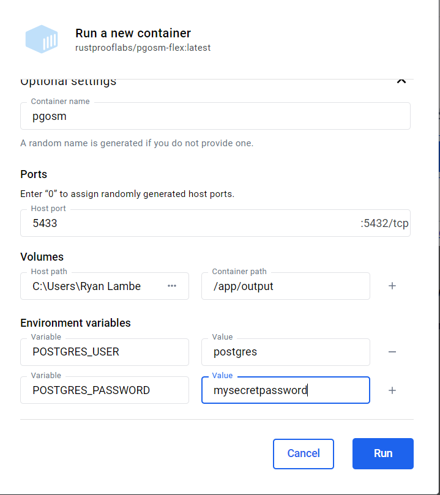
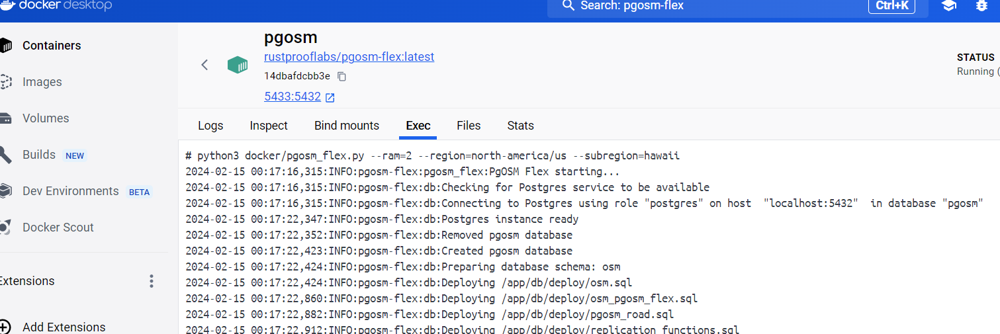

# PgOSM Flex on Windows

PgOSM Flex can be used on Windows via Docker Desktop.
This page outlines a few Windows-specific steps where they deviate from the experience
on Linux.

## Install Docker Desktop

> FIXME:  Add link to instructions on installing.  Highlight basic process, incl. user group for non-admin users.

## Create Folder

> FIXME:  Show folder under `~\Documents\pgosm-data`

## Download Docker Image

Search for the `rustprooflabs/pgosm-flex` Docker image via Docker Desktop.

> FIXME:  Add screenshot

## Run Docker Container

When running the container you might be prompted by Windows Defender about Docker Desktop
and the firewall.  Most users should click Cancel on this step. You do not need to "Allow access"
in order to connect to your Docker container from the computer running Docker.

> You should understand the risks of opening up the Postgres port in your firewall.  This topic is beyond the scope of this documentation.

> FIXME:  Add example of what it looks like when running.

## Docker exec

